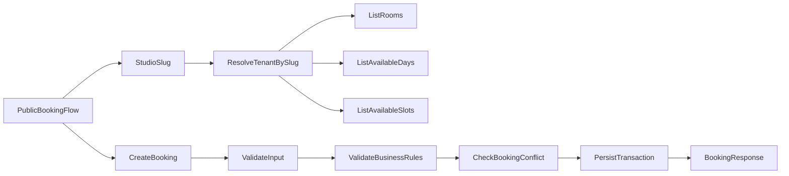

# StageFlow SaaS/White-label - Visao do Produto e Escopo de Reservas (Fase 1)

## 1) O que o produto faz hoje (mapeado no frontend)

### Fluxo publico de reservas
- Rota publica por tenant: `/studio/[studioSlug]`
- Jornada em 5 passos:
  1. Escolha da sala
  2. Data e horario
  3. Dados do cliente
  4. Confirmacao
  5. Pagamento
- Estado da reserva em andamento mantido no client (store local).

### Operacao interna (painel admin)
- Dashboard com metricas principais.
- Agenda operacional das reservas.
- Gestao de clientes.
- Notificacoes.
- Configuracoes do estudio.

### White-label / multi-tenant
- Tenant identificado por `studioSlug` na URL publica.
- Personalizacao visual (logo e paleta de cores).
- Estrategia comercial com subdominio e opcao de dominio customizado.
- Planos com indicativo de `API` e `White-label` no tier enterprise.

### Estado atual tecnico
- Dados ainda mockados no frontend (sem API real).
- Sem autenticacao/autorizacao efetiva no frontend atual.
- Sem middleware de protecao de rotas.

## 2) Objetivo da fase 1 do backend (reservas)

Entregar uma API real multi-tenant para substituir o mock da camada de reservas, cobrindo:
- consulta de salas publicas por tenant;
- consulta de disponibilidade (dias/slots);
- criacao de reserva publica;
- leitura operacional de reservas no admin (hoje/agenda);
- consulta de clientes no admin.

## 3) Escopo funcional da fase 1

### Incluido
- Cadastro e leitura de `studios`, `rooms`, `clients`, `bookings`.
- Regras de negocio para validacao de horario e conflito.
- Resolucao de tenant por `studioSlug` no contexto publico.
- Endpoints admin protegidos por sessao/token (studio resolvido no backend).
- Base pronta para evoluir pagamentos e notificacoes.

### Fora de escopo (fase posterior)
- Checkout financeiro completo (gateway e conciliacao final).
- Politicas avancadas de cancelamento/reembolso.
- Automacoes de notificacao em tempo real.
- RBAC completo por perfis finos.

## 4) Regras de negocio obrigatorias (fase 1)

- Horario da reserva deve respeitar janela do estudio (`openHour`/`closeHour`).
- Reserva precisa ser continua (sem buracos no intervalo).
- `startHour < endHour`, minimo de 1 hora.
- Nao permitir sobreposicao de reservas para mesma sala/data/faixa horaria.
- `totalPrice = (endHour - startHour) * room.pricePerHour`.
- Status inicial:
  - `confirmed` em fluxo simplificado;
  - `pending` se confirmacao depender de pagamento assincrono.

## 5) Fluxo de dados esperado

## 6) Resultado esperado para o backend

Ao final da fase 1, o backend deve permitir:
- substituir as funcoes mock de reservas por chamadas reais;
- renderizar disponibilidade real no passo de data/horario;
- criar reservas consistentes sem risco de dupla ocupacao.
