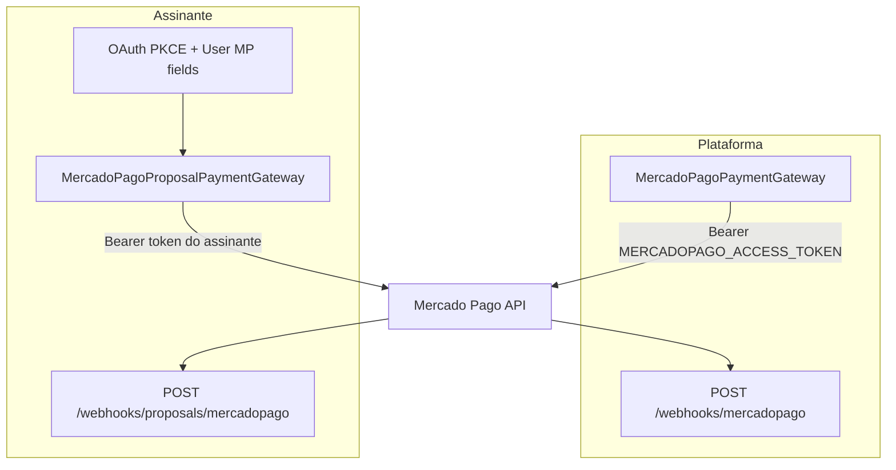

# Integração Mercado Pago no GigManager — documentação para reutilização (ex.: Reserva Estúdio)

Este documento descreve **como o GigManager integra com o Mercado Pago** no backend NestJS: OAuth (MPC), checkout de **assinatura da plataforma**, checkout de **pagamentos do assinante** (hoje modelados como “proposta/orçamento”), webhooks, dados persistidos e jobs. Serve como **mapa de implementação** para clonar o padrão em outro produto (por exemplo, **Reserva Estúdio**: assinatura + **reservas** no lugar de propostas).

**Fonte do código:** a integração completa está na branch **`origin/master`** do repositório `gigmanager-backend`. Em outros branches (por exemplo `auth-complete`) ela pode estar ausente; use `git show origin/master:<caminho>` ou faça checkout de `master` para inspecionar os arquivos citados.

---

## Índice

1. [Objetivo e glossário](#1-objetivo-e-glossário)
2. [Visão geral da arquitetura](#2-visão-geral-da-arquitetura)
3. [Variáveis de ambiente](#3-variáveis-de-ambiente)
4. [Configuração no painel Mercado Pago](#4-configuração-no-painel-mercado-pago)
5. [Modelo de dados (Prisma)](#5-modelo-de-dados-prisma)
6. [Fluxo A — OAuth e credenciais do assinante](#6-fluxo-a--oauth-e-credenciais-do-assinante)
7. [Fluxo B — Checkout de assinatura (plataforma)](#7-fluxo-b--checkout-de-assinatura-plataforma)
8. [Fluxo C — Checkout de proposta (cliente paga o assinante)](#8-fluxo-c--checkout-de-proposta-cliente-paga-o-assinante)
9. [Webhooks e segurança](#9-webhooks-e-segurança)
10. [Jobs agendados (cron)](#10-jobs-agendados-cron)
11. [Endpoints HTTP relevantes](#11-endpoints-http-relevantes)
12. [Erros e pontos de atenção](#12-erros-e-pontos-de-atenção)
13. [Mapeamento para Reserva Estúdio](#13-mapeamento-para-reserva-estúdio)
14. [Índice de arquivos (referência rápida)](#14-índice-de-arquivos-referência-rápida)

---

## 1. Objetivo e glossário

### Objetivo

- **Plataforma cobra assinatura** do usuário (GigManager): usa **token da aplicação** (`MERCADOPAGO_ACCESS_TOKEN`).
- **Cliente final paga o assinante** (orçamento/proposta): usa **token do assinante** (OAuth ou manual), com suporte a **taxa de aplicação** (`application_fee`) quando a conexão é OAuth (marketplace).

### Glossário

| Termo | Significado no GigManager |
|--------|---------------------------|
| **Checkout transparente** | Pagamento via API (`POST /v1/payments`) com token de cartão gerado no frontend, ou PIX/boleto retornando QR/ticket. |
| **Preapproval** | Assinatura recorrente no Mercado Pago; no código, fluxo em duas etapas (criar `pending`, depois vincular `card_token_id`). |
| **`external_reference`** | String de conciliação enviada ao MP; webhooks e suporte usam para localizar entidades. |
| **`application_fee`** | Valor em **reais** retido pela plataforma em pagamentos na conta do assinante (OAuth). |
| **MPC / OAuth** | Fluxo para o assinante autorizar o app e gravar `access_token`, `refresh_token`, `public_key`, `user_id` no `User`. |

---

## 2. Visão geral da arquitetura

Padrão **DDD + gateways na infra**: o domínio define interfaces (`PaymentGateway`, `ProposalPaymentGateway`); a implementação HTTP do Mercado Pago fica em `src/infra/payment/`.

**Dependências NPM:** não há SDK oficial `mercadopago` no `package.json` de `master`; as chamadas usam **`fetch`** (assinatura) e **axios** (OAuth). Base URL e versão vêm de `EnvConfig` / env.

---

## 3. Variáveis de ambiente

Definição e validação: [`src/infra/config/env.ts`](src/infra/config/env.ts). Valores derivados (URLs de webhook, frontend): [`src/infra/config/env.config.ts`](src/infra/config/env.config.ts).

### Tabela (nome → uso)

| Variável | Obrigatória (schema) | Uso |
|----------|----------------------|-----|
| `MERCADOPAGO_ACCESS_TOKEN` | Sim | Token da **conta da aplicação** para assinatura e pagamentos da plataforma (`MercadoPagoPaymentGateway`). |
| `MERCADOPAGO_CLIENT_ID` | Sim | OAuth. |
| `MERCADOPAGO_CLIENT_SECRET` | Sim | OAuth. |
| `MERCADOPAGO_OAUTH_REDIRECT_URI` | Sim | Callback OAuth (deve coincidir com o app no MP). |
| `MERCADOPAGO_WEBHOOK_SECRET` | Opcional no Zod | **Atenção:** o validador de assinatura **não** lê esta variável — ver abaixo. |
| `MERCADOPAGO_API_URL` | Opcional | Padrão `https://api.mercadopago.com`. |
| `MERCADOPAGO_API_VERSION` | Opcional | Padrão `v1`. |
| `MERCADOPAGO_BOLETO_BANK_ID` | Opcional | ID do boleto em `/v1/payments` (ex.: `bolbradesco`); padrão no código: `bolbradesco`. |
| `BACKEND_URL` | Sim | Monta URLs de webhook e `notification_url`. |
| `FRONTEND_URL` | Sim | `back_urls` / redirecionamentos; localhost com HTTPS é normalizado para HTTP em `normalizedFrontendUrl`. |

### Inconsistência: segredo do webhook

- Em [`src/infra/payment/mercadopago-webhook-signature-validator.ts`](src/infra/payment/mercadopago-webhook-signature-validator.ts) a chave lida é **`MERCADOPAGO_WEBHOOK_SECRET_KEY`**.
- Em [`src/infra/config/env.ts`](src/infra/config/env.ts) aparece **`MERCADOPAGO_WEBHOOK_SECRET`** (opcional).

**Recomendação para deploy:** configurar **`MERCADOPAGO_WEBHOOK_SECRET_KEY`** conforme o código do validador, ou alinhar o código ao nome usado no Zod — até lá, a documentação operacional deve seguir o **nome efetivo no validador**.

Comportamento do validador:

- Sem chave: em **produção** retorna inválido (webhooks rejeitados); em **desenvolvimento** aceita (com aviso).
- Com chave: exige header `x-signature`; compara HMAC SHA-256 do **payload string** recebido (ver nota na [seção 9](#9-webhooks-e-segurança)).

---

## 4. Configuração no painel Mercado Pago

1. **Aplicação OAuth:** criar app, configurar `redirect_uri` = `MERCADOPAGO_OAUTH_REDIRECT_URI`.
2. **Webhooks de pagamento / assinatura:** apontar para `{BACKEND_URL}/webhooks/mercadopago` (notificações de `payment`, `preapproval` / `subscription` conforme o que o MP enviar).
3. **Webhooks de proposta:** a `notification_url` é definida no código como `{BACKEND_URL}/webhooks/proposals/mercadopago` — garantir que o MP alcance essa URL em produção.
4. **Desautorização OAuth:** `{BACKEND_URL}/webhooks/mercadopago/deauthorization` (payload documentado no controller).
5. **Chave secreta de assinatura:** alinhar com `MERCADOPAGO_WEBHOOK_SECRET_KEY` (ver seção 3).

---

## 5. Modelo de dados (Prisma)

Arquivo: [`prisma/schema.prisma`](prisma/schema.prisma) (em `master`).

### `User` — Mercado Pago

Campos principais: `mercadoPagoConnectionType` (`OAUTH` | `MANUAL`), `mercadoPagoAccessToken`, `mercadoPagoPublicKey`, `mercadoPagoUserId`, `mercadoPagoRefreshToken`, `mercadoPagoTokenExpiresAt`, `mercadoPagoConnectedAt`, `mercadoPagoLastTestAt`. Opcional: `systemFeePercent` (split / taxa — relacionado a regras de negócio de indicação/taxa).

### Assinatura da plataforma

- **`Plan`**: planos (tipo, preço em centavos, etc.).
- **`Subscription`**: vínculo usuário–plano; `mercadoPagoSubscriptionId`, `mercadoPagoPaymentId`, status, períodos, trial.
- **`Payment`**: pagamentos de assinatura; `mercadoPagoId` único; valores em **centavos**; `metadata` JSON.
- **`PaymentReceipt`**: comprovantes de boleto enviados pelo usuário; fluxo admin em use cases dedicados.

### Proposta / pagamento do cliente

- **`Proposal`**: orçamento; `totalAmount` em **centavos**; `publicLink` único; status (`pending`, `paid_30`, etc.).
- **`ProposalPayment`**: pagamento MP por proposta; `mercadoPagoId` único; `installment` (30, 50, 100); valores em centavos.

---

## 6. Fluxo A — OAuth e credenciais do assinante

### OAuth com PKCE

- **Gateway:** [`src/infra/payment/mercadopago-oauth-gateway.ts`](src/infra/payment/mercadopago-oauth-gateway.ts) — `generateAuthorizationUrl` (legado no gateway), troca de código por token com `code_verifier`, `refreshToken`, `testConnection`, `shouldRefreshToken`, `calculateExpirationDate`.
- **Controller:** [`src/infra/http/controllers/mercadopago-oauth.controller.ts`](src/infra/http/controllers/mercadopago-oauth.controller.ts)
  - `GET /auth/mercadopago/connect` (JWT): gera `state`, PKCE (`code_challenge` S256), guarda `code_verifier` em memória associado ao `state`, retorna URL de autorização.
  - `GET /auth/mercadopago/callback` (público): recebe `code` e `state`; recupera `code_verifier`; chama use case de processamento.
- **Callback:** [`src/domain/auth/application/use-cases/process-mercadopago-callback.ts`](src/domain/auth/application/use-cases/process-mercadopago-callback.ts) — `state` no formato `userId:randomToken`; persiste tokens com `user.setMercadoPagoOAuthCredentials(...)`.

### Renovação de token

- [`src/domain/auth/application/services/mercadopago-credentials.service.ts`](src/domain/auth/application/services/mercadopago-credentials.service.ts): para OAuth, se faltam menos de **7 dias** para expirar, renova com `refresh_token` e atualiza o usuário.

### Credenciais manuais

- Use case/controller de **Payment Settings**: salvar access token + public key manualmente (tipo `MANUAL`). Ver [`src/infra/http/controllers/payment-settings.controller.ts`](src/infra/http/controllers/payment-settings.controller.ts) e [`src/domain/auth/application/use-cases/save-mercado-pago-credentials.ts`](src/domain/auth/application/use-cases/save-mercado-pago-credentials.ts).

### Desautorização

- MP chama `POST /webhooks/mercadopago/deauthorization` com `user_id`, `application_id`, `action: application.deauthorized`.
- [`src/domain/auth/application/services/mercadopago-deauthorization-webhook.service.ts`](src/domain/auth/application/services/mercadopago-deauthorization-webhook.service.ts) localiza o usuário por `mercadoPagoUserId` e executa disconnect.

**Nota:** o endpoint de desautorização **não** passa pelo mesmo validador HMAC dos webhooks de pagamento (`MercadoPagoWebhookSignatureValidator`); valida apenas corpo básico no controller.

---

## 7. Fluxo B — Checkout de assinatura (plataforma)

### HTTP

- **`POST /checkout/subscription`** (JWT): [`src/infra/http/controllers/checkout.controller.ts`](src/infra/http/controllers/checkout.controller.ts) → [`src/domain/subscription/application/use-cases/create-subscription.ts`](src/domain/subscription/application/use-cases/create-subscription.ts).

### Gateway

[`src/infra/payment/mercadopago-payment-gateway.ts`](src/infra/payment/mercadopago-payment-gateway.ts)

- **`createPayment`:** `POST /{version}/payments` com `Bearer MERCADOPAGO_ACCESS_TOKEN`, `X-Idempotency-Key`, `notification_url` = `EnvConfig.webhookUrl` (`{BACKEND_URL}/webhooks/mercadopago`).
- **`external_reference` (pagamento avulso):** padrão `payment-{planType}-uid-{userId}[-sub-{subscriptionId}]-ts-{timestamp}-{random}` — usado no [`handle-webhook`](src/domain/subscription/application/use-cases/handle-webhook.ts) para criar/atualizar `Payment` quando o registro ainda não existe.
- **Cartão:** `token`, `installments`, `capture`, `three_d_secure_mode: optional`.
- **PIX:** CPF em `payer.identification`.
- **Boleto:** documento + endereço completo; valor mínimo **R$ 0,50**; `date_of_expiration` opcional; mapeamento `payment_method_id` para boleto via `MERCADOPAGO_BOLETO_BANK_ID` ou `bolbradesco`.
- **`createSubscription` (recorrência):** fluxo documentado no próprio arquivo — **etapa 1** `POST /preapproval` com `status: pending` e `auto_recurring` (frequência mensal ou 12 meses para anual); **etapa 2** `PUT /preapproval/{id}` com `card_token_id` se houver token. `notification_url` e `external_reference` (`subscription-{subscriptionId}` ou fallback com plano + random). `back_urls` vêm de `EnvConfig.checkoutUrls`.
- **Valores de plano** em `getAmountForPlanType` estão **fixos no código** (ex.: BASIC 2900 centavos) — em outro produto normalmente virão do banco ou config.

### Webhook de assinatura

[`src/domain/subscription/application/use-cases/handle-webhook.ts`](src/domain/subscription/application/use-cases/handle-webhook.ts)

- `type === payment`: consulta MP via `getPayment`, sincroniza `Payment`; se não achar no banco, tenta resolver assinatura/`userId` via `external_reference` ou `mercadoPagoPaymentId` na `Subscription`.
- `type === preapproval` ou `subscription`: `getSubscription` no MP, atualiza status local (`cancelled`, `paused`, `authorized`).

Também dispara completar indicação em pagamento aprovado (`CompleteReferralOnSubscriptionUseCase`).

---

## 8. Fluxo C — Checkout de proposta (cliente paga o assinante)

### Visão

1. Cliente acessa dados públicos da proposta: **`GET /proposals/public/:publicLink`** — resposta inclui **`publicKey` do assinante** para o frontend tokenizar cartão (crítico para evitar `diff_param_bins`).
2. Cliente paga: **`POST /proposals/:id/payments`** — [`src/infra/http/controllers/proposals.controller.ts`](src/infra/http/controllers/proposals.controller.ts) → [`src/domain/proposal/application/use-cases/create-proposal-payment.ts`](src/domain/proposal/application/use-cases/create-proposal-payment.ts).

### Regras de negócio (use case)

- Resolve **assinante** dono da proposta; obtém credenciais com **`MercadoPagoCredentialsService.getValidCredentials`** (renova OAuth se necessário).
- **Cartão de crédito/débito:** exige plano que permita MP (`PlanLimitsService.canUseMercadoPago` — planos Profissional/Anual no modelo atual).
- **Valor:** `amount = round(proposal.totalAmount * installment/100)` com installment **30, 50 ou 100** (`PaymentInstallment`).
- Mínimos em **centavos:** PIX 1, boleto 50, cartão 100.
- Conflito: não permitir outro pagamento **pendente ou aprovado** para o mesmo installment.
- Após criar no MP, persiste **`ProposalPayment`** com status **PENDING**; **não** marca a proposta como paga até o webhook aprovar.

### Gateway

[`src/infra/payment/mercadopago-proposal-payment-gateway.ts`](src/infra/payment/mercadopago-proposal-payment-gateway.ts)

- `POST /v1/payments` com `Bearer` = **token do assinante**.
- `notification_url`: `{BACKEND_URL}/webhooks/proposals/mercadopago`.
- `external_reference`: `proposal-{proposalId}-installment-{installment}-ts-{timestamp}-{random}`.
- **`transaction_amount`:** sempre em **reais** (float), derivado de centavos com `parseFloat((amount/100).toFixed(2))`.
- **OAuth:** envia `application_fee` em reais: **10%** do valor, arredondado, **mínimo R$ 1,00**, e não pode ser ≥ valor da transação.
- **Cartão:** repassa `issuer_id` e `payment_method_id` se vierem do frontend; `statement_descriptor` (ex.: `GigManager`); logs detalhados para depuração de `diff_param_bins`.
- **PIX/Boleto:** mesma linha da assinatura (documento; boleto com endereço).

### Webhook

[`src/domain/proposal/application/use-cases/handle-proposal-payment-webhook.ts`](src/domain/proposal/application/use-cases/handle-proposal-payment-webhook.ts)

- Exige **`ProposalPayment` já existente** no banco com o `mercadoPagoId` (caso contrário retorna sucesso com mensagem de “ainda não criado” — limitação: sem registro local não há `proposalId` para buscar token).
- Busca pagamento no MP com **`subscriber.mercadoPagoAccessToken`** (sem passar pelo `MercadoPagoCredentialsService` — **token expirado OAuth** pode exigir melhoria futura).
- Atualiza status; se **approved**, atualiza status da proposta (`paid_30`, `paid_50`, `paid_100`) e chama **`SyncProposalToShowUseCase`**.

### Cancelamento de PIX expirado

[`src/domain/proposal/application/use-cases/cancel-expired-pix-payments.ts`](src/domain/proposal/application/use-cases/cancel-expired-pix-payments.ts) + cron (abaixo): usa **`getValidCredentials`** e `cancelPayment` no gateway.

---

## 9. Webhooks e segurança

### Endpoints

| Método e caminho | Controller | Função |
|------------------|------------|--------|
| `POST /webhooks/mercadopago` | [`webhook.controller.ts`](src/infra/http/controllers/webhook.controller.ts) | Pagamentos/preapproval de **assinatura** (plataforma). |
| `POST /webhooks/proposals/mercadopago` | [`proposal-payment-webhook.controller.ts`](src/infra/http/controllers/proposal-payment-webhook.controller.ts) | Pagamentos de **proposta**; só processa `type/topic === payment`. |
| `POST /webhooks/mercadopago/deauthorization` | [`mercadopago-webhook.controller.ts`](src/infra/http/controllers/mercadopago-webhook.controller.ts) | Revoga OAuth no banco. |

**Roteamento NestJS:** `WebhookController` usa `@Controller('/webhooks')` + `@Post('mercadopago')`. `MercadoPagoWebhookController` usa `@Controller('/webhooks/mercadopago')` + `@Post('deauthorization')` — **sem conflito**.

### Formato do body

Os controllers aceitam:

- Formato 1: `{ type: "payment", data: { id } }`
- Formato 2: `{ topic: "payment", resource: "id" }`

### Assinatura (`x-signature`)

Implementação: [`src/infra/payment/mercadopago-webhook-signature-validator.ts`](src/infra/payment/mercadopago-webhook-signature-validator.ts). HMAC SHA-256 do payload com `MERCADOPAGO_WEBHOOK_SECRET_KEY`, comparação *timing-safe*.

**Observação de integração:** o controller faz `JSON.stringify(body)` **depois** do parse do Express. Se o Mercado Pago assinar o corpo bruto exatamente como enviado, qualquer diferença de espaçamento pode invalidar a assinatura. Vale validar em produção com o formato oficial do MP para o seu runtime.

---

## 10. Jobs agendados (cron)

| Arquivo | Agendamento | Função |
|---------|---------------|--------|
| [`src/infra/services/cancel-expired-pix-cron.service.ts`](src/infra/services/cancel-expired-pix-cron.service.ts) | A cada 1 minuto | Cancela PIX de proposta pendente com mais de **30 minutos** (`CancelExpiredPixPaymentsUseCase`). |
| [`src/infra/services/check-pending-boleto-cron.service.ts`](src/infra/services/check-pending-boleto-cron.service.ts) | Diário 9h | Boletos de **assinatura** pendentes; desativa assinaturas não confirmadas após **5 dias úteis** (`CheckPendingBoletoPaymentsUseCase`). |

`@nestjs/schedule` é registrado em [`src/infra/app.module.ts`](src/infra/app.module.ts) (ver `master`).

---

## 11. Endpoints HTTP relevantes

- **Assinatura:** `POST /checkout/subscription` (JWT).
- **OAuth:** `GET /auth/mercadopago/connect` (JWT), `GET /auth/mercadopago/callback` (público).
- **Credenciais manuais / teste:** `POST /payment-settings/mercado-pago/credentials`, endpoints de teste no mesmo controller (ver arquivo completo).
- **Proposta pública:** `GET /proposals/public/:publicLink` (público).
- **Pagamento de proposta:** `POST /proposals/:id/payments` (**público**, `@Public()` — cliente final paga sem JWT).

---

## 12. Erros e pontos de atenção

### `diff_param_bins` (cartão na proposta)

O gateway e o Swagger enfatizam:

- **Mesmo valor** usado no CardForm e no backend (`transaction_amount` em reais = centavos/100).
- **Mesmas parcelas** (`installments`).
- Enviar **`issuerId`** e **`paymentMethodId`** se o token foi gerado com eles.
- Usar a **`publicKey` do assinante** retornada no GET público da proposta — **não** a da plataforma.

### Rejeições de risco

`create-proposal-payment` mapeia mensagens para `cc_rejected_high_risk`, `rejected_by_bank`, etc.

### Valores em centavos vs reais

- **Banco interno:** centavos (`Proposal.totalAmount`, `ProposalPayment.amount`, `Payment.amount`).
- **API Mercado Pago `transaction_amount`:** **reais** (float), com arredondamento explícito na proposta.

### Webhook de proposta sem linha no banco

Se o MP notificar antes de persistir `ProposalPayment`, o fluxo atual **não** consulta o MP sem contexto — o cliente deve garantir ordem **criar pagamento → salvar registro → webhook**, ou evoluir o use case (ex.: extrair `proposalId` do `external_reference` com token de plataforma/admin — decisão de produto).

### Valores de plano na assinatura

`getAmountForPlanType` no gateway de assinatura usa **constantes**; o modelo `Plan` no Prisma pode divergir se os preços forem mudados só no banco.

---

## 13. Mapeamento para Reserva Estúdio

Objetivo análogo: **você cobra assinatura**; **o assinante cobra o cliente final** (reserva de sala).

| GigManager | Reserva Estúdio (sugestão) |
|------------|----------------------------|
| `Proposal` | `Reservation` (sala, horário, valor total, status). |
| `ProposalPayment` | `ReservationPayment` (`mercadoPagoId`, valor, método, status). |
| `publicLink` | Link público da reserva ou token seguro para checkout guest. |
| Installment 30/50/100 | Regras do negócio: sinal + saldo, ou pagamento único; modelar enum próprio. |
| `POST .../payments` | `POST /reservations/:id/payments` ou recurso equivalente. |
| `GET .../public/:link` | Expor `subscriberPublicKey`, valores e regras de pagamento. |
| `notification_url` | Nova URL dedicada, ex.: `/webhooks/reservations/mercadopago`, para não misturar com propostas. |
| `external_reference` | Padrão estável, ex.: `reservation-{id}-phase-{SINAL|TOTAL}-ts-...`. |
| `application_fee` | Reutilizar só se o modelo de marketplace for igual; preferir **percentual configurável** (`User.systemFeePercent` ou env) em vez de 10% fixo. |
| `SyncProposalToShowUseCase` | Equivalente de domínio (ex.: confirmar slot, bloquear agenda, notificar). |

**Assinatura da plataforma** pode ser copiada quase **1:1** (mesmo `MercadoPagoPaymentGateway` conceitualmente, com preços e planos do novo produto).

**OAuth + credenciais** do estúdio: mesmo fluxo (`MercadoPagoOAuthGateway`, PKCE, campos no `User`).

---

## 14. Índice de arquivos (referência rápida)

### Infra — pagamento

- [`src/infra/payment/mercadopago-payment-gateway.ts`](src/infra/payment/mercadopago-payment-gateway.ts)
- [`src/infra/payment/mercadopago-proposal-payment-gateway.ts`](src/infra/payment/mercadopago-proposal-payment-gateway.ts)
- [`src/infra/payment/mercadopago-oauth-gateway.ts`](src/infra/payment/mercadopago-oauth-gateway.ts)
- [`src/infra/payment/mercadopago-webhook-signature-validator.ts`](src/infra/payment/mercadopago-webhook-signature-validator.ts)
- [`src/infra/payment/payment.module.ts`](src/infra/payment/payment.module.ts)

### HTTP

- [`src/infra/http/controllers/checkout.controller.ts`](src/infra/http/controllers/checkout.controller.ts)
- [`src/infra/http/controllers/webhook.controller.ts`](src/infra/http/controllers/webhook.controller.ts)
- [`src/infra/http/controllers/proposal-payment-webhook.controller.ts`](src/infra/http/controllers/proposal-payment-webhook.controller.ts)
- [`src/infra/http/controllers/mercadopago-webhook.controller.ts`](src/infra/http/controllers/mercadopago-webhook.controller.ts)
- [`src/infra/http/controllers/mercadopago-oauth.controller.ts`](src/infra/http/controllers/mercadopago-oauth.controller.ts)
- [`src/infra/http/controllers/payment-settings.controller.ts`](src/infra/http/controllers/payment-settings.controller.ts)
- [`src/infra/http/controllers/proposals.controller.ts`](src/infra/http/controllers/proposals.controller.ts)
- [`src/infra/http/controllers/payment-receipt.controller.ts`](src/infra/http/controllers/payment-receipt.controller.ts)
- [`src/infra/http/controllers/payment-status.controller.ts`](src/infra/http/controllers/payment-status.controller.ts)

### Domínio

- [`src/domain/subscription/application/gateways/payment-gateway.ts`](src/domain/subscription/application/gateways/payment-gateway.ts)
- [`src/domain/subscription/application/use-cases/create-subscription.ts`](src/domain/subscription/application/use-cases/create-subscription.ts)
- [`src/domain/subscription/application/use-cases/handle-webhook.ts`](src/domain/subscription/application/use-cases/handle-webhook.ts)
- [`src/domain/subscription/application/use-cases/check-pending-boleto-payments.ts`](src/domain/subscription/application/use-cases/check-pending-boleto-payments.ts)
- [`src/domain/proposal/application/gateways/proposal-payment-gateway.ts`](src/domain/proposal/application/gateways/proposal-payment-gateway.ts)
- [`src/domain/proposal/application/use-cases/create-proposal-payment.ts`](src/domain/proposal/application/use-cases/create-proposal-payment.ts)
- [`src/domain/proposal/application/use-cases/handle-proposal-payment-webhook.ts`](src/domain/proposal/application/use-cases/handle-proposal-payment-webhook.ts)
- [`src/domain/proposal/application/use-cases/sync-proposal-to-show.ts`](src/domain/proposal/application/use-cases/sync-proposal-to-show.ts)
- [`src/domain/auth/application/services/mercadopago-credentials.service.ts`](src/domain/auth/application/services/mercadopago-credentials.service.ts)
- [`src/domain/auth/application/use-cases/process-mercadopago-callback.ts`](src/domain/auth/application/use-cases/process-mercadopago-callback.ts)

### Testes

- [`src/infra/payment/mercadopago-payment-gateway.spec.ts`](src/infra/payment/mercadopago-payment-gateway.spec.ts)
- [`test/mercadopago-oauth.e2e-spec.ts`](test/mercadopago-oauth.e2e-spec.ts)
- Vários `*.spec.ts` em auth/subscription relacionados a MP (listados pelo `git grep` em `master`).

---

*Documento gerado a partir da análise do código em `origin/master`. Ao evoluir o backend, atualize este arquivo ou o versionamento da branch de referência.*
